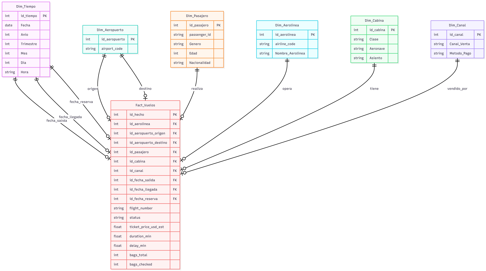

# Universidad de San Carlos de Guatemala
# Facultad de Ingenieria
# Escuela de Ciencias y Sistemas

## Nombre: Edgar Josías Cán Ajquejay
## Carnet: 202112012

# Documentacion - Practica 1

## Diseño del Modelo Multidimensional (Esquema en Estrella)

Para la implementación del Data Warehouse de la práctica, se utilizó la metodología de modelado dimensional. El objetivo principal fue transformar los datos transaccionales (planos) en un **Esquema en Estrella** altamente optimizado para consultas analíticas y generación de indicadores clave de rendimiento (KPIs).

El proceso de diseño se dividió en las siguientes fases estratégicas:

### 1. Definición de la Tabla de Hechos (`Fact_Vuelos`)
Se identificó que el proceso de negocio central a medir es la **operación y venta de vuelos**. Por lo tanto, se construyó la tabla `Fact_Vuelos` en el centro del esquema, la cual almacena la granularidad transaccional del modelo.
* **Métricas Cuantitativas:** Se depuraron las columnas para almacenar únicamente los datos medibles y sumables que aportan valor al negocio. Entre ellas destacan: el precio estandarizado (`ticket_price_usd_est`), tiempo de vuelo (`duration_min`), retrasos (`delay_min`) y conteo de equipaje (`bags_total`, `bags_checked`).
* **Dimensiones Degeneradas:** Atributos como el número de vuelo (`flight_number`) y el estado operacional (`status`) se mantuvieron directamente en la tabla de hechos al no requerir tablas de atributos adicionales, optimizando el espacio de almacenamiento.

### 2. Identificación y Creación de Dimensiones
Para proveer contexto a las métricas (el *quién, cómo y dónde*), se abstrajeron los datos descriptivos hacia tablas de dimensiones satelitales. 
* Se generaron las dimensiones: `Dim_Pasajero`, `Dim_Aerolinea`, `Dim_Cabina` y `Dim_Canal`.
* **Implementación de Llaves Sustitutas (Surrogate Keys):** En lugar de utilizar las cadenas de texto (strings) originales como identificadores, se generaron llaves primarias numéricas auto-incrementales (`INT IDENTITY`) para cada dimensión. Esto garantiza un cruce de información (JOINs) considerablemente más rápido, reduce el tamaño de almacenamiento de la tabla de hechos e independiza el modelo de los cambios operativos en los sistemas origen.

### 3. Implementación de Dimensiones de "Juego de Roles" (Role-Playing Dimensions)
Aca se implemento el manejo de atributos que comparten la misma naturaleza pero distinto contexto dentro de un mismo evento (como el aeropuerto de origen/destino y las múltiples fechas de un vuelo). Para evitar la redundancia de datos, se aplicó el patrón de **Role-Playing Dimensions**:
* **Roles Geográficos:** Se creó una única tabla `Dim_Aeropuerto` con el catálogo maestro de códigos. La tabla de hechos se conecta a esta dimensión a través de dos llaves foráneas distintas: `id_aeropuerto_origen` e `id_aeropuerto_destino`.
* **Roles Temporales:** Se generó una sola dimensión calendario (`Dim_Tiempo`) que descompone las fechas en Año, Trimestre, Mes y Día. Posteriormente, la tabla de hechos hace referencia a esta misma dimensión en tres momentos distintos del ciclo de vida del vuelo: `id_fecha_salida`, `id_fecha_llegada` e `id_fecha_reserva`.

## Documentación del Proceso ETL (Extracción, Transformación y Carga)

El proceso ETL fue desarrollado en **Python**, utilizando la librería **Pandas** para la manipulación de datos en memoria y **SQLAlchemy** junto con `pyodbc` para la orquestación y conexión con el motor de base de datos SQL Server (alojado en un contenedor de Docker). 

El flujo de trabajo se divide en las siguientes tres fases principales:

### Fase 1: Extracción (Extract)
La extracción de los datos se realiza desde una fuente plana. Se lee el archivo origen `dataset_vuelos_crudo(1).csv` utilizando la función `pd.read_csv()` de Pandas, cargando la totalidad de los registros transaccionales en un DataFrame (estructura de datos tabular en memoria) para su posterior procesamiento.

### Fase 2: Transformación (Transform)
Esta es la fase crítica de limpieza y estandarización, diseñada para garantizar la calidad del dato (Data Quality) antes de ingresarlo al Data Warehouse. Se aplicaron las siguientes reglas de negocio:

* **Manejo de Nulos Ocultos:** Se implementó una expresión regular (`r'^\s*$'`) para identificar celdas que visualmente estaban vacías o contenían espacios en blanco, convirtiéndolas en verdaderos valores nulos (`NaN`) para que el sistema pudiera procesarlas.
* **Estandarización de Texto:** Los códigos de los aeropuertos (origen y destino) y los géneros se limpiaron de espacios residuales y se forzaron a letras mayúsculas (`.str.upper()`). Los nombres de las aerolíneas se formatearon a *Title Case* (Letra inicial mayúscula).
* **Conversión de Tipos de Datos (Casting):** Los valores monetarios (`ticket_price` y `ticket_price_usd_est`) que venían con formato europeo (comas en lugar de puntos decimales) fueron limpiados y casteados al tipo numérico `float`.
* **Estandarización Temporal:** Las columnas de fechas presentaban formatos mixtos (ej. sistemas de 12h y 24h). Se utilizó `pd.to_datetime(format='mixed')` para unificar todas las fechas bajo el estándar internacional `YYYY-MM-DD HH:MM:SS`.
* **Imputación de Datos Faltantes:** * Los valores nulos en columnas categóricas (`passenger_nationality`, `sales_channel`, `seat`) se rellenaron con la etiqueta descriptiva `'Unknown'`.
  * Las edades faltantes (`passenger_age`) se sustituyeron por la **mediana** de las edades existentes para no sesgar la distribución estadística.
  * Los minutos de duración y retraso faltantes se imputaron con un valor numérico de `0`.
* **Auditoría:** Como paso final de esta fase, se generó un archivo de auditoría (`dataset_vuelos_transformado.xlsx`) para verificar la calidad de la limpieza antes de la inserción en base de datos.

### Fase 3: Carga (Load)
La carga hacia la base de datos `Vuelos_DW` en SQL Server se ejecutó respetando la integridad referencial del modelo de Esquema en Estrella, dividida en dos etapas secuenciales:

1. **Carga de Dimensiones (Catálogos):**
   Se extrajeron los valores únicos (`drop_duplicates()`) del DataFrame maestro para cada entidad (Aeropuertos, Aerolíneas, Pasajeros, Canales y Cabinas). Se renombraron las columnas para coincidir exactamente con la estructura de la base de datos y se insertaron mediante `.to_sql()`. Destaca la `Dim_Tiempo`, la cual fue descompuesta algorítmicamente en atributos de Año, Trimestre, Mes, Día y Hora directamente desde Python. En este paso, SQL Server generó automáticamente las *Surrogate Keys* (IDs numéricos) para cada registro.

2. **Carga de la Tabla de Hechos (`Fact_Vuelos`):**
   Dado que el Data Warehouse utiliza llaves foráneas numéricas en lugar de textos, se realizó un mapeo de datos:
   * Se consultaron los catálogos recién creados desde SQL Server hacia la memoria de Python (`pd.read_sql`).
   * Se utilizaron cruces lógicos (`pd.merge`) equivalentes a *LEFT JOINs* para reemplazar los textos del CSV original por los IDs numéricos generados por la base de datos.
   * Finalmente, se filtró el DataFrame para contener exclusivamente llaves foráneas y métricas cuantitativas, insertando el lote completo en la tabla `Fact_Vuelos`.

## Pasos de Ejecución

Para reproducir el entorno y ejecutar el flujo completo del proyecto, se deben seguir los siguientes pasos en orden secuencial:

### 1. Requisitos Previos
* Instalación de **Docker** y **Docker Compose**.
* Instalación de **Python 3.x**.
* Instalación de **ODBC Driver 17 for SQL Server** en el sistema operativo anfitrión.
* Microsoft Power BI Desktop para la visualización.

### 2. Despliegue de la Base de Datos (Docker)

Se automatizó la creación de la base de datos utilizando contenedores.
1. Navegar en la terminal hacia el directorio que contiene los archivos `docker-compose.yml` y `db.sql`.
2. Ejecutar el comando para levantar los servicios:
   `docker-compose up -d`
3. El contenedor principal iniciará el motor de SQL Server, mientras que un contenedor secundario (sidecar) esperará 15 segundos para ejecutar automáticamente el script `db.sql`, creando la base de datos `Vuelos_DW` y todas sus tablas sin intervención manual.

### 3. Ejecución del Script ETL (Python)
1. Abrir una terminal y asegurar la instalación de las dependencias de Python:
   `pip install pandas numpy sqlalchemy pyodbc openpyxl`
2. Ejecutar el script principal de transformación y carga:
   `python ETL.py`
3. El script leerá el archivo CSV crudo, aplicará las reglas de limpieza, generará un archivo Excel de auditoría y realizará la inserción masiva en SQL Server. La consola mostrará el progreso hasta emitir el mensaje de éxito.

### 4. Visualización y Análisis (Power BI)
1. Abrir el archivo `.pbix` adjunto en el proyecto.
2. Si es necesario actualizar los datos, hacer clic en el botón **Actualizar** en la cinta de opciones para que Power BI consulte directamente el contenedor de SQL Server a través del puerto `1433`.

---

## Resultados Obtenidos

La ejecución exitosa del proyecto arrojó los siguientes resultados técnicos y de negocio:

* **Integridad del Flujo de Datos:** Se logró migrar el 100% de los registros transaccionales válidos (10,000 hechos) desde un archivo plano desestructurado hacia un motor relacional.
* **Calidad de Datos (Data Quality):** Se erradicaron inconsistencias tipográficas, se estandarizaron los tipos de datos (fechas, monedas) y se imputaron valores nulos estratégicamente (medias numéricas y etiquetas "Unknown"), evitando la pérdida de registros valiosos.
* **Optimización Multidimensional:** La implementación del esquema en estrella redujo drásticamente la redundancia. Por ejemplo, 20,000 apariciones de aeropuertos de origen y destino en el archivo crudo se comprimieron a un catálogo único de 15 registros en la `Dim_Aeropuerto`.
* **Cero Anomalías Referenciales:** Las pruebas de auditoría en SQL Server confirmaron la ausencia de valores huérfanos (`NULL`) en las llaves foráneas de la tabla de hechos.
* **Inteligencia de Negocios Activa:** Se construyó un Dashboard interactivo que permite responder preguntas de negocio al instante, visualizando ingresos totales por aerolínea, distribución demográfica de los pasajeros y fluctuaciones operativas a lo largo del tiempo, todo respondiendo en milisegundos gracias a la arquitectura subyacente.