# Universidad de San Carlos de Guatemala
# Facultad de Ingenieria
# Escuela de Ciencias y Sistemas

## Nombre: Edgar Josías Cán Ajquejay
## Carnet: 202112012

# Documentacion - Practica 2

# Explicación de las gráficas y KPIs del dashboard

## 1. Top 5 destinos en viajes
Esta gráfica de barras horizontales muestra los cinco destinos con mayor cantidad de vuelos registrados en el periodo analizado. Su propósito es identificar los aeropuertos que concentran más tráfico, lo cual permite reconocer rutas de alta demanda y puntos estratégicos dentro de la operación aérea. Desde una perspectiva analítica, esta visualización ayuda a priorizar destinos clave para decisiones relacionadas con planificación de rutas, asignación de recursos y análisis de mercado.

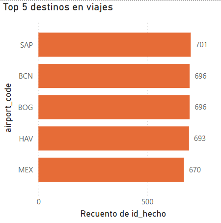

## 2. Cantidad de vuelos por mes
Este KPI resume la cantidad total de vuelos en el contexto filtrado actualmente. Su función es ofrecer una visión rápida del nivel de actividad aérea durante el periodo seleccionado. Es un indicador importante porque ayuda a contextualizar el resto del dashboard: un volumen alto de vuelos puede explicar incrementos en retrasos, cambios en ingresos o variaciones en la distribución de pasajeros y clases.

## 3. Total retrasos por mes
Este KPI representa la suma total de los minutos de retraso acumulados en el periodo filtrado. Es uno de los indicadores más importantes del dashboard porque refleja directamente el desempeño operativo del sistema de vuelos. Su utilidad estratégica está en medir la eficiencia temporal de las operaciones, permitiendo identificar si en ciertos periodos existe una acumulación significativa de retrasos que pueda afectar la experiencia del pasajero, la puntualidad y la calidad del servicio.

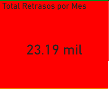

## 4. Vuelos por clase
Esta gráfica de dona muestra la distribución de los vuelos según la clase del boleto, por ejemplo Economy, Business, Premium Economy o First. Su propósito es identificar cómo se distribuye la demanda entre los distintos niveles de servicio ofrecidos por las aerolíneas. Esta visualización es útil para comprender el perfil comercial del mercado, ya que permite observar qué segmento domina en cantidad de reservas y cuáles tienen una participación más reducida.

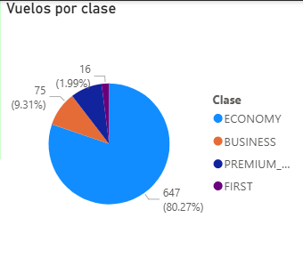

## 5. Género
Esta gráfica de dona presenta la distribución de pasajeros según género. Su objetivo es ofrecer una caracterización demográfica general de la población transportada dentro del conjunto de datos. Desde una perspectiva de análisis, esta visualización permite describir la composición de la demanda y puede complementarse con otros factores, como nacionalidad, destinos o clase, para obtener una visión más integral del comportamiento de los pasajeros.

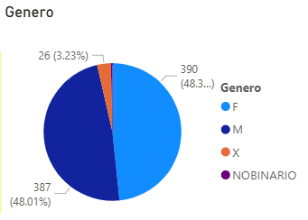

## 6. Total retrasos por año y nombre de aerolínea
Esta gráfica de área apilada muestra la evolución de los retrasos acumulados por aerolínea a lo largo del tiempo. Su utilidad principal es permitir comparar cómo contribuye cada aerolínea al total de retrasos en distintos periodos. Es una visualización importante porque no solo muestra la magnitud del retraso, sino también su comportamiento temporal, lo cual ayuda a detectar tendencias, estabilidad operativa o incrementos progresivos en ciertas compañías.

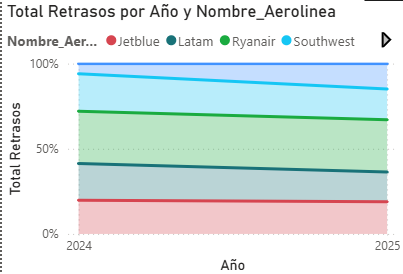

## 7. Suma de ganancias por aerolínea
Esta gráfica compara la suma estimada de ingresos o ganancias generadas por cada aerolínea a partir del precio de los boletos. Su propósito es identificar qué aerolíneas concentran mayor valor económico dentro del dataset. Desde el punto de vista estratégico, permite relacionar el volumen de operaciones con el aporte financiero de cada compañía, ayudando a diferenciar entre aerolíneas con mucho tráfico y aerolíneas con mayor rentabilidad promedio.

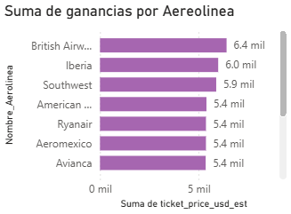

## 8. Precio promedio por mes (KPI)
Este KPI resume el valor promedio del precio de los boletos dentro del contexto filtrado. Mientras la gráfica de líneas muestra la evolución temporal, este indicador ofrece una lectura inmediata del nivel general de precios. Es útil para tener una referencia rápida del comportamiento económico del periodo seleccionado y para compararlo con otros indicadores como cantidad de vuelos o ganancias acumuladas.

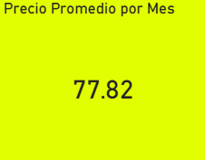

## 9. Duración promedio por mes
Este KPI muestra la duración promedio de los vuelos dentro del contexto analizado. Su objetivo es ofrecer una visión resumida del tiempo medio de trayecto que caracteriza a los vuelos registrados. Este valor es relevante porque ayuda a interpretar otras métricas, como precio promedio o retraso acumulado, ya que vuelos más largos suelen estar asociados con estructuras operativas y comerciales distintas a las de vuelos cortos.

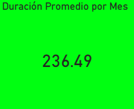

## 10. Segmentador de aerolínea
El filtro de aerolínea permite al usuario seleccionar una o varias compañías específicas para analizar su comportamiento de forma aislada. Su importancia está en que transforma el dashboard en una herramienta interactiva, permitiendo estudiar con mayor detalle la operación, el volumen, los retrasos, los ingresos y la distribución de pasajeros de cada aerolínea.

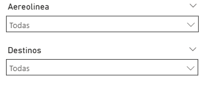

## 11. Segmentador de destinos
El filtro de destinos permite concentrar el análisis en uno o varios aeropuertos de llegada. Gracias a este control, el usuario puede evaluar cómo cambian los indicadores principales según el destino seleccionado. Esto resulta útil para identificar diferencias entre rutas, detectar destinos con mayor congestión, mayor volumen o mayor concentración de ingresos.

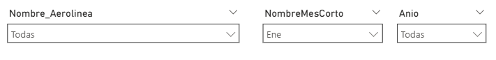

## 12. Segmentador de mes
El filtro de mes permite acotar el análisis a un rango mensual específico. Su función es facilitar comparaciones temporales y permitir al usuario estudiar la operación aérea en ventanas concretas de tiempo. Esto es relevante para identificar comportamientos estacionales, meses de mayor actividad, incrementos de retrasos o variaciones en precios.

## 13. Segmentador de año
El filtro de año permite observar el comportamiento de los indicadores según el año seleccionado. Su utilidad está en facilitar comparaciones temporales más amplias y permitir el análisis de tendencias interanuales. Este control es especialmente importante para estudiar la evolución general del sistema de vuelos y contextualizar gráficas como la de retrasos por aerolínea a lo largo del tiempo.

## Interpretación general del dashboard
En conjunto, el dashboard integra indicadores operativos, comerciales y demográficos para ofrecer una visión amplia del comportamiento de los vuelos. Las gráficas de volumen permiten entender la magnitud de la operación, las gráficas económicas muestran el comportamiento de precios e ingresos, y las gráficas de composición ayudan a describir a los pasajeros y la estructura del servicio. Los filtros convierten el informe en una herramienta interactiva que facilita el análisis por periodo, aerolínea y destino, permitiendo una exploración más detallada y útil para la toma de decisiones.

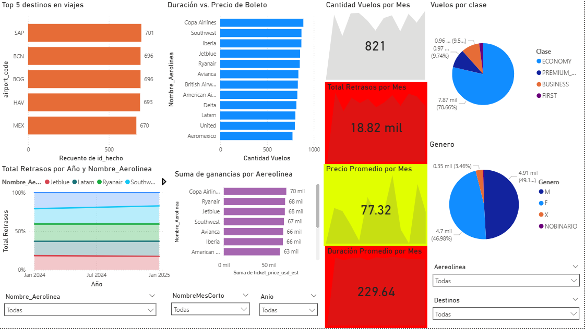