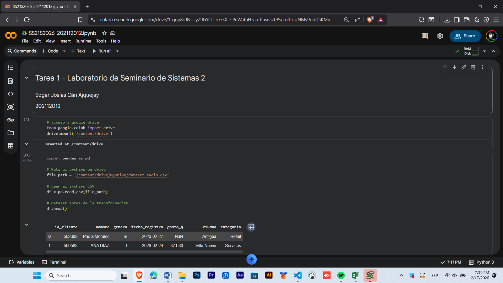
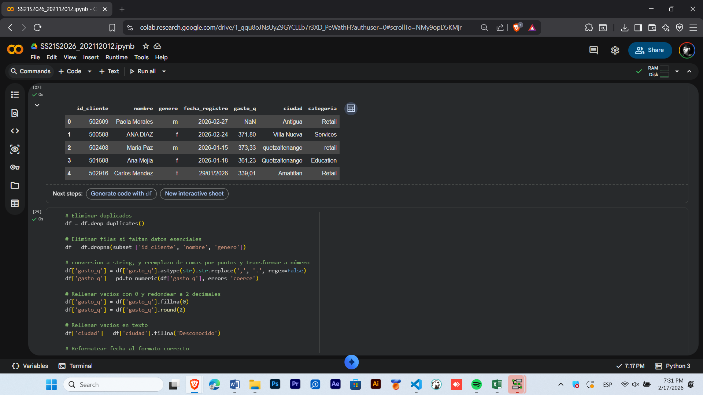
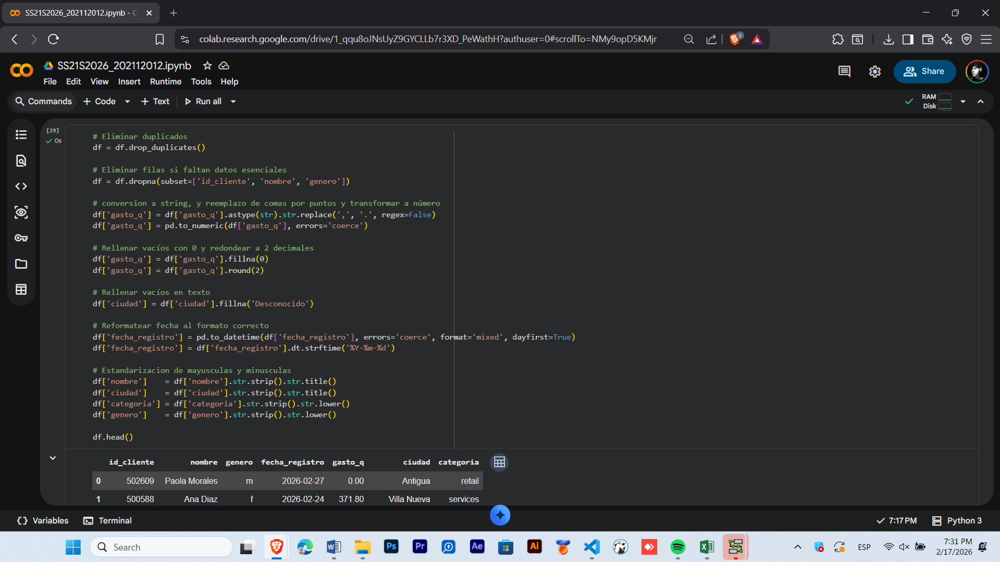
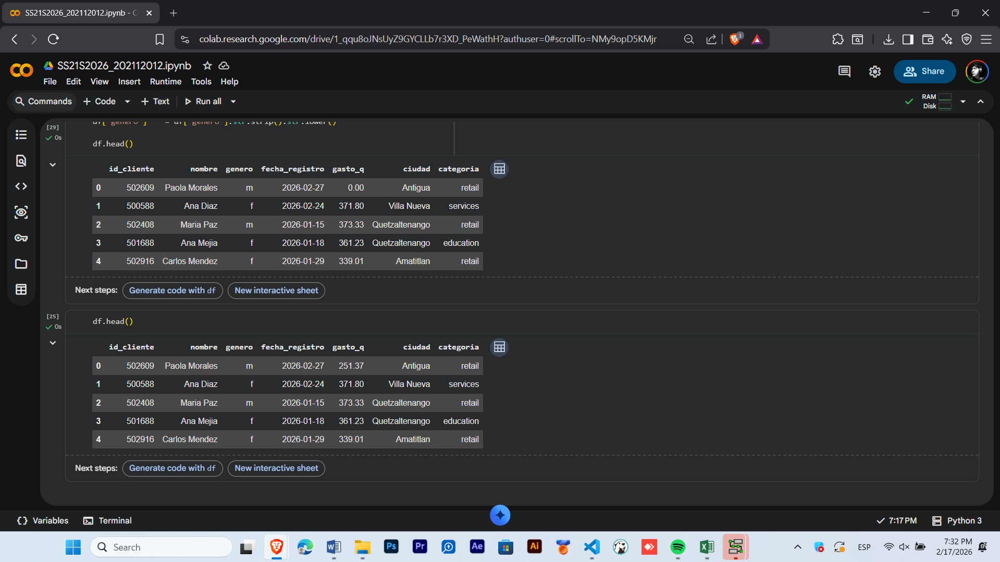

# DOCUMENTACION TRANSFORMACION DE DATOS

## Nombre del dataset
#### dataset_sucio.csv

## Descripcion del proceso de limpieza
- Se realizo un flujo de limpieza usando el concepto de ETL usando la libreria de pandas de python.

- Se descartaron filas duplicadas y las que no tengan identificacion de nombre o id

- Se corrigio la mezcla de separadores, usando el punto decimal en vez de la coma, se convirtio el valor a texto 
y se transformo a numerico en formato float.

- los valores nulos en gastos se estandarizaron con 0 y los gastos quedaron notacion de 2 decimales

-Se unificaron mayusculas/minusculas en nombres, ciudades y categorias y se formateo la fecha en formato ISO.

## Capturas del proceso

## intepretacion concisa de los resultados
El dataset resultante cuenta con integridad referencial (sin IDs nulos) y consistencia numérica. Al asumir los gastos nulos como 0.00, se evita sesgar el promedio de ventas hacia arriba, ofreciendo una visión realista de la facturación que incluye a los usuarios inactivos o que solo se registraron sin comprar, ademas se definio estandares de fechas y nombres para mantener los datos correctamente escritos.