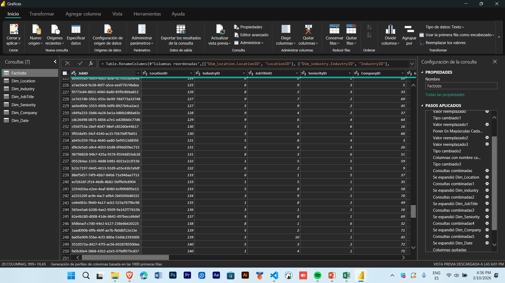
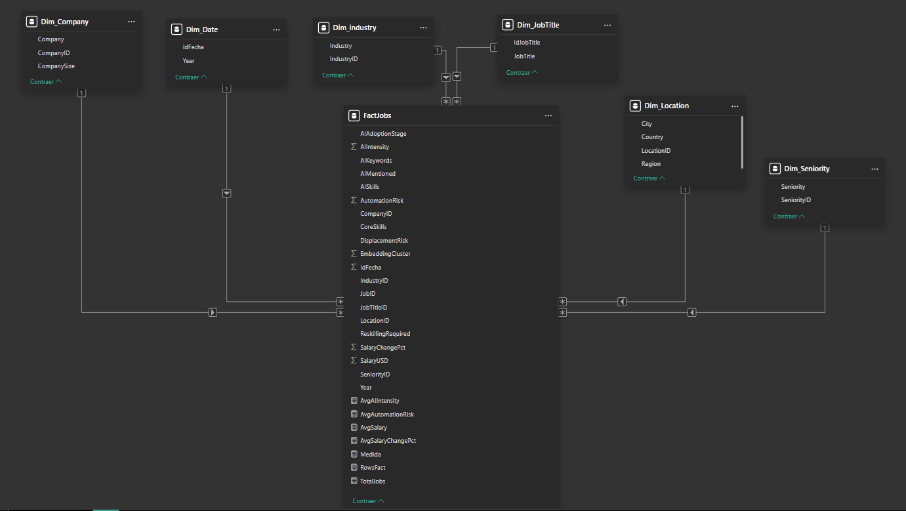
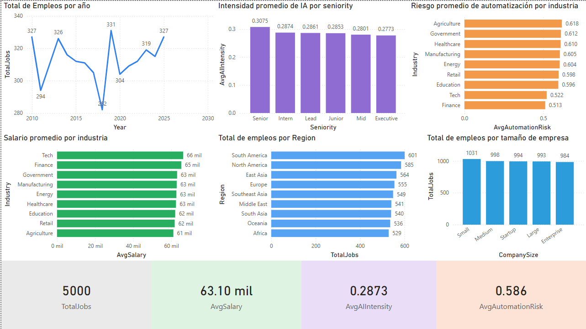
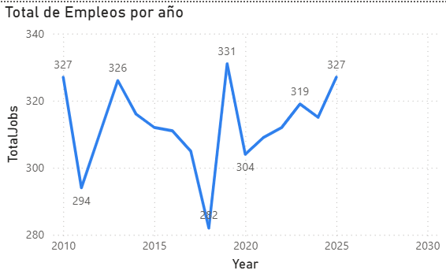
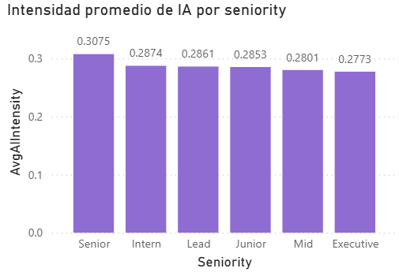
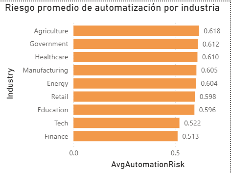
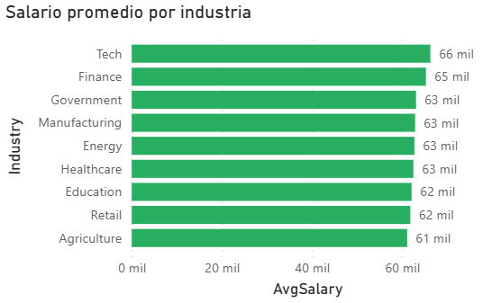
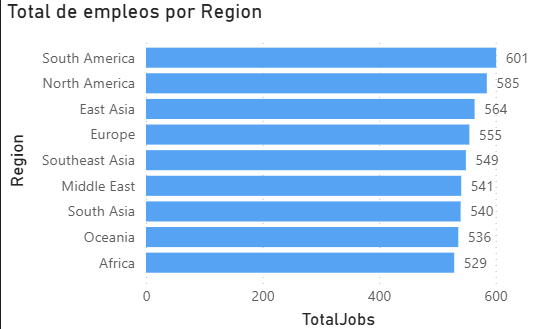
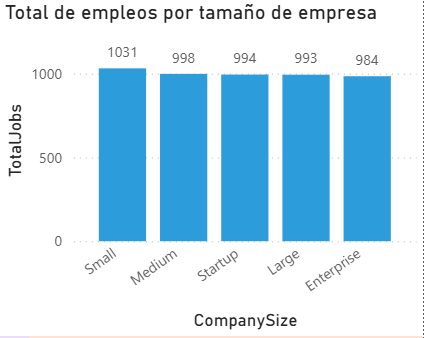

# Universidad de San Carlos de Guatemala
# Facultad de Ingenieria
# Escuela de Ciencias y Sistemas

## Nombre: Edgar Josías Cán Ajquejay
## Carnet: 202112012

# Documentacion - Tarea 2

# Descripcion del dataset
El dataset “Global AI Impact on Jobs (2010–2025)” contiene información sintética sobre 5000 ofertas de empleo a nivel global entre los años 2010 y 2025. Cada registro representa una vacante laboral e incluye datos sobre ubicación, empresa, industria, puesto, nivel de seniority, salario, además de variables relacionadas con el impacto de la inteligencia artificial, como mención de IA en la oferta, habilidades de IA requeridas, intensidad de uso de IA, riesgo de automatización, necesidad de reentrenamiento y riesgo de desplazamiento laboral.

Su propósito es analizar cómo la IA ha influido en el mercado laboral, las habilidades demandadas y la evolución de los empleos en distintos sectores y regiones.

# Descripción de las transformaciones realizadas al dataset

Al dataset Global AI Impact on Jobs (2010–2025) se le aplicaron transformaciones en Power Query con el objetivo de limpiarlo, estandarizarlo y prepararlo para su análisis en Power BI.

Primero, se realizó el renombramiento de columnas para usar nombres más cortos, claros y consistentes, facilitando su manejo dentro del modelo. Luego se corrigieron los tipos de datos, asignando formato numérico a campos como salario, puntajes de intensidad de IA y riesgo de automatización, y formato texto a columnas descriptivas como país, ciudad, industria y puesto.

También se efectuó una limpieza de datos de texto, aplicando procesos como quitar espacios innecesarios al inicio y al final, limpiar caracteres ocultos y estandarizar valores para evitar categorías duplicadas por diferencias de escritura. 

Además, se revisó la posible existencia de registros duplicados, especialmente en la columna identificadora de empleo, y se verificaron valores nulos o vacíos en campos importantes para el análisis.

# Descripcion de la creacion de Diagrama Estrella y Justificacion
Para construir un modelo de datos más ordenado, eficiente y fácil de analizar en Power BI, el dataset original fue transformado desde una única tabla plana hacia una estructura de tipo esquema estrella. Esto se hizo porque el archivo CSV contenía en una sola tabla tanto los datos numéricos de análisis como los atributos descriptivos de contexto, lo que generaba redundancia y dificultaba la organización del modelo.

Por ello, se separó la información en una tabla de hechos, llamada FactJobs, que conserva los registros principales de las ofertas laborales y las métricas de análisis, como salario, intensidad de IA, riesgo de automatización y necesidad de reskilling; y varias tablas de dimensiones, creadas a partir de atributos descriptivos repetitivos como ubicación, industria, puesto, seniority, empresa y fecha.

Las tablas de dimensiones surgieron con el propósito de normalizar la información, reducir duplicidad de valores y facilitar las relaciones dentro del modelo. Así, por ejemplo, en lugar de repetir el nombre de la industria o la región en cada fila de la tabla principal, estos datos se separaron en tablas específicas como Dim_Industry, Dim_Location, Dim_JobTitle, Dim_Seniority, Dim_Company y Dim_Date. Luego, cada dimensión recibió un identificador único, el cual fue incorporado a la tabla de hechos mediante combinaciones (merge) en Power Query.

De esta forma, el modelo final quedó organizado con una tabla central y varias tablas satélite relacionadas en una estructura estrella, mejorando la claridad del modelo, el rendimiento de las visualizaciones y la capacidad de segmentar la información en los reportes.

# INTEPRETACION DE GRAFICAS

### DASHBOARD PRINCIPAL

### 1. Total de empleos por año

Explicación: Muestra la cantidad de empleos registrados en cada año del periodo 2010–2025.

Interpretación: Permite ver cómo varía el número de ofertas laborales con el tiempo y comparar años con más o menos empleos.

### 2. Intensidad promedio de IA por seniority

Explicación: Compara el promedio de intensidad de IA según el nivel de seniority.

Interpretación: Permite identificar qué nivel de experiencia presenta mayor relación con el uso o presencia de IA.

### 3. Riesgo promedio de automatización por industria

Explicación: Muestra el riesgo promedio de automatización en cada industria.

Interpretación: Permite comparar qué sectores tienen mayor o menor exposición a ser automatizados.

### 4. Salario promedio por industria

Explicación: Presenta el salario promedio de los empleos según la industria.

Interpretación: Permite identificar qué sectores ofrecen mejores salarios en promedio.

### 5. Total de empleos por región

Explicación: Muestra la distribución total de empleos en cada región.

Interpretación: Permite comparar qué regiones concentran más ofertas laborales.

### 6. Total de empleos por tamaño de empresa

Explicación: Compara la cantidad de empleos según el tamaño de la empresa.

Interpretación: Permite ver qué tipo de empresa aporta más empleos en el dataset.

### 7. KPIs

Explicación: Resumen general de métricas clave como total de empleos, salario promedio, intensidad de IA y riesgo de automatización.

Interpretación: Dan una visión rápida del comportamiento general del dataset.

